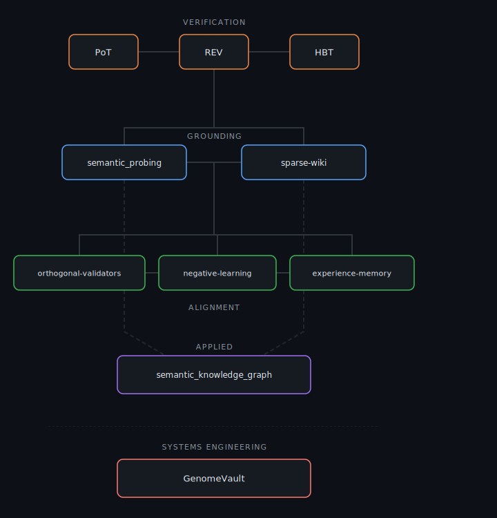

# Rohan Vinaik

If you've ever wondered whether a model behind an API is actually what it claims to be — or why an LLM confidently says Einstein invented the telephone — or how to make a system learn from failures without retraining — you're in the right place.

I build AI systems where **every decision is traceable**. Not interpretable-in-theory. Traceable-in-practice: you can follow the path from input to output and explain each step.

  

---

## The Research Arc

This started with a simple question: *how do you verify what a model IS when you can't see the weights?*

That led to behavioral fingerprinting. Which led to asking *what does a model KNOW, and can we explain why it's wrong?* Which led to semantic grounding. Which led to *what should a model NOT do, and can we guarantee it?* Which led to alignment mechanisms.

Three questions. One thread: **if you can't explain it, you can't trust it.**

---

## Phase 1 · Verification

*Can we identify a model through behavior alone?*

| | |
|:---|:---|
| [**PoT_Experiments**](https://github.com/rohanvinaik/PoT_Experiments) | Cryptographic model identity via behavioral fingerprints. 90.9% accuracy distinguishing base models from fine-tuned variants — on a consumer Mac, for ~$0.50 of electricity. |
| [**REV**](https://github.com/rohanvinaik/REV) | Neural networks have "restriction sites" — layer boundaries where behavioral variance spikes. Target these to verify 70B models in 3-4GB of memory. |
| [**HBT_Validator**](https://github.com/rohanvinaik/HBT_Validator) | Hyperdimensional fingerprints that capture architectural lineage. Detects if a model was distilled, fine-tuned, or family-related — without weight access. |

**Not:** Gradient probing (requires full model in memory) · Not embedding similarity (can't explain *why* models differ)

---

## Phase 2 · Grounding

*Can we explain what a model knows — and why it's wrong?*

| | |
|:---|:---|
| [**semantic_probing**](https://github.com/rohanvinaik/semantic_probing) | Route queries through 62 universal semantic primitives with Hadamard-guaranteed orthogonality. 100% routing precision. 273μs per query. No training required. |
| [**sparse-wiki-grounding**](https://github.com/rohanvinaik/sparse-wiki-grounding) | Typed knowledge links with explicit reasoning chains. When an LLM hallucinates, this tells you *why* it's wrong and *who actually did* what it's misattributing. |

**Not:** RAG retrieval (finds relevant docs but doesn't explain errors) · Not embedding lookup (cosine similarity tells you nothing about *why*)

---

## Phase 3 · Alignment

*Can we guarantee what a system won't do?*

| | |
|:---|:---|
| [**orthogonal-validators**](https://github.com/rohanvinaik/orthogonal-validators) | Standard ensembles have correlated failures. Orthogonal validators use structurally independent decompositions — when all report low confidence, that's signal about inherent ambiguity. **0% error rate** on auto-accepted outputs. |
| [**negative-learning**](https://github.com/rohanvinaik/negative-learning) | Minsky's censors and suppressors: learn constraints from failures. **22× more sample-efficient** than positive examples — because "don't touch hot stoves" is smaller than "all safe kitchen behaviors." |
| [**experience-memory**](https://github.com/rohanvinaik/experience-memory) | O(1) fix lookup for recurring errors. ~1.6μs retrieval. Proactive "dreaming" generates edge cases before deployment. No gradient descent. |

**Not:** RLHF (catches problems after deployment) · Not hard-coded rules (brittle, doesn't generalize)

---

## Applied

| | |
|:---|:---|
| [**semantic_knowledge_graph**](https://github.com/rohanvinaik/semantic_knowledge_graph) | Extract knowledge graphs where **position encodes meaning**. Wikipedia-grounded, interpretable, ~1ms extraction. |

---

## Systems Engineering

| | |
|:---|:---|
| [**GenomeVault**](https://github.com/rohanvinaik/GenomeVault) | Privacy-preserving genomics with cryptographic guarantees. Sub-second queries, 128-bit ZK proofs, information-theoretic PIR. 7-layer privacy pipeline from raw genome to encrypted query. The orthogonal-validators architecture was validated here first — 99.9999% accuracy on 3.7M clinical positions. |

---

<b>Foundations</b>

 

- **Kanerva** — Hyperdimensional computing, sparse distributed representations
- **Wierzbicka** — Natural Semantic Metalanguage, cross-cultural primitives
- **Minsky** — Society of Mind, censors and suppressors, K-lines
- **Collins & Loftus** — Spreading activation in semantic memory
- **Winston** — Near-miss learning, arch-learning

---

Working on interpretable AI, verification, or alignment? Let's talk → [Website](https://www.RohanV.Me) &nbsp; · &nbsp; [Contact](mailto:rohanpvinaik@gmail.com)
