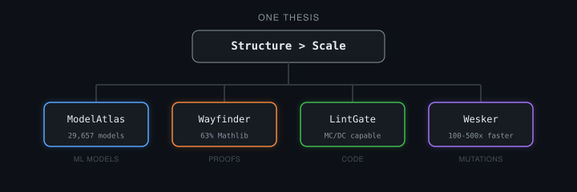

# Rohan Vinaik

If you've ever wondered why proving a theorem in Lean requires 671B parameters and a datacenter — or tried to find the right model on HuggingFace and given up — or asked how many tests it actually takes to fully specify a program — you're in the right place.

I build systems where structure does the work that scale usually gets credit for. Same principle across domains: find the geometry, navigate it, let cheap search handle the rest.

  

---

## The Research Arc

This started with a simple question: *how do you verify what a model IS when you can't see the weights?*

That led to behavioral fingerprinting. Which led to semantic grounding. Which led to a broader realization: the geometric navigation approach that worked for model verification kept working — for ML model search, formal theorem proving, code specification, and mutation testing.

One paradigm. Four systems:

---

## What I've Built

| | |
|:---|:---|
| [**ModelAtlas**](https://github.com/rohanvinaik/ModelAtlas) | Google for open-source AI models. 29,657 models, 166 semantic anchors, <100ms queries, no GPU. HuggingFace has 800K models and no way to search by meaning — so I built a coordinate system. |
| [**Wayfinder**](https://github.com/rohanvinaik/Wayfinder) | Proof compiler for Lean 4. 63% of a 2,000-theorem random Mathlib sample in one pass on commodity hardware, using a 22M-parameter encoder. 28% requires no trained model at all. On MiniF2F-test, 6 of 15 AIME problems — matching DeepSeek-Prover-V2 (671B parameters, datacenter) on a laptop. Infrastructure that amplifies every downstream prover — not a competing model. |
| [**LintGate**](https://github.com/rohanvinaik/LintGate) | Specification compiler. MC/DC verification-capable — achieved 100% mutation kill rate on a 30K-model codebase. Debugging drops to zero under supervision. The question it answers: *how many tests does it take to fully specify a program?* |
| [**Wesker**](https://github.com/rohanvinaik/Wesker) | In-process AST mutation testing for Python. 100–500x faster than mutmut or cosmic-ray. Zero dependencies. ~1,770 lines. Mutation testing has been "too expensive to use" for 48 years — Wesker restructures the computation. |

Same principle. Consumer hardware. Biochemist by training, self-taught in formal methods.

---

<b>Earlier Work</b>

 

The flagship projects grew out of three research threads:

**Verification** — Can we identify a model through behavior alone?

| | |
|:---|:---|
| [PoT_Experiments](https://github.com/rohanvinaik/PoT_Experiments) | Cryptographic model identity via behavioral fingerprints. 90.9% accuracy distinguishing base models from fine-tuned variants — on a consumer Mac, for ~$0.50 of electricity. |
| [REV](https://github.com/rohanvinaik/REV) | Neural networks have "restriction sites" — layer boundaries where behavioral variance spikes. Target these to verify 70B models in 3–4GB of memory. |
| [HBT_Validator](https://github.com/rohanvinaik/HBT_Validator) | Hyperdimensional fingerprints that capture architectural lineage. Detects if a model was distilled, fine-tuned, or family-related — without weight access. |

**Grounding** — Can we explain what a model knows — and why it's wrong?

| | |
|:---|:---|
| [semantic_probing](https://github.com/rohanvinaik/semantic_probing) | Route queries through 62 universal semantic primitives with Hadamard-guaranteed orthogonality. 100% routing precision. 273us per query. No training required. |
| [sparse-wiki-grounding](https://github.com/rohanvinaik/sparse-wiki-grounding) | Typed knowledge links with explicit reasoning chains. When an LLM hallucinates, this tells you *why* it's wrong and *who actually did* what it's misattributing. |

**Alignment** — Can we guarantee what a system won't do?

| | |
|:---|:---|
| [orthogonal-validators](https://github.com/rohanvinaik/orthogonal-validators) | Standard ensembles have correlated failures. Orthogonal validators use structurally independent decompositions — when all report low confidence, that's signal about inherent ambiguity. **0% error rate** on auto-accepted outputs. |
| [negative-learning](https://github.com/rohanvinaik/negative-learning) | Minsky's censors and suppressors: learn constraints from failures. **22x more sample-efficient** than positive examples — because "don't touch hot stoves" is smaller than "all safe kitchen behaviors." |
| [experience-memory](https://github.com/rohanvinaik/experience-memory) | O(1) fix lookup for recurring errors. ~1.6us retrieval. Proactive "dreaming" generates edge cases before deployment. No gradient descent. |

**Applied**

| | |
|:---|:---|
| [ShortcutForge](https://github.com/rohanvinaik/ShortcutForge) | Natural language compiler for Apple Shortcuts — describe what you want, get a signed .shortcut binary. Compiler, not prompter. |
| [GenomeVault](https://github.com/rohanvinaik/GenomeVault) | Privacy-preserving genomics with cryptographic guarantees. Sub-second queries, 128-bit ZK proofs, information-theoretic PIR. 7-layer privacy pipeline from raw genome to encrypted query. |
| [Yami](https://github.com/rohanvinaik/Yami) | The Wayfinder thesis applied to chess. 6 cheap signals whose interference pattern IS the correct move. Work in progress. |

<b>Foundations</b>

 

Kanerva (hyperdimensional computing) · Wierzbicka (semantic primitives) · Minsky (censors, suppressors, K-lines) · Collins & Loftus (spreading activation) · Winston (near-miss learning)

---

Independent researcher · Cambridge, MA · Biochemist by training · [RohanV.me](https://www.RohanV.Me) · [rohanpvinaik@gmail.com](mailto:rohanpvinaik@gmail.com)
